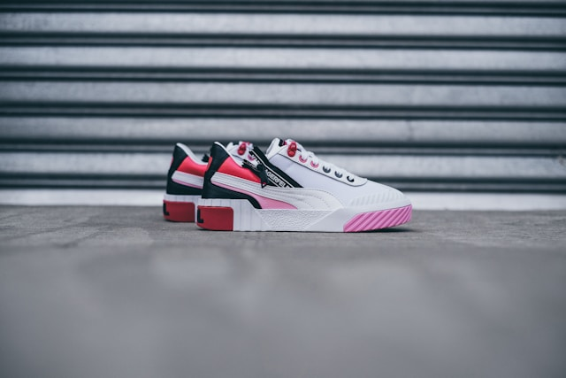

# yahoo-inc/photo-background-generation

This is an implementation of the [yahoo-inc/photo-background-generation](https://huggingface.co/yahoo-inc/photo-background-generation) as a Cog model. [Cog packages machine learning models as standard containers.](https://github.com/replicate/cog)

First, download the pre-trained weights:

    cog run script/download-weights

Then, you can run predictions:

    cog predict r8.im/dhanushreddy291/photo-background-generation -i 'image="https://unsplash.com/photos/AYIeSFWhEB8/download?force=true&w=640"' -i 'prompt="A Shoe on a marble podium, product photography, high resolution"' -i 'num_outputs=1' -i 'negative_prompt="3d, cgi, render, bad quality, normal quality"' -i 'num_inference_steps=30' -i 'controlnet_conditioning_scale=1'

## Example:

### Input image

"A Shoe on a marble podium, product photography, high resolution"

